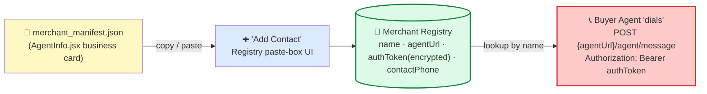
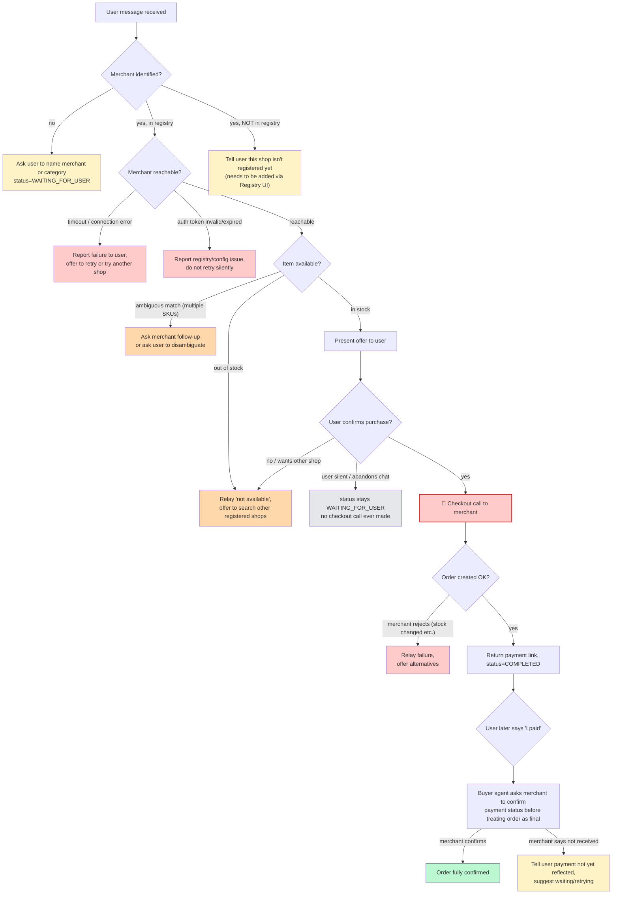
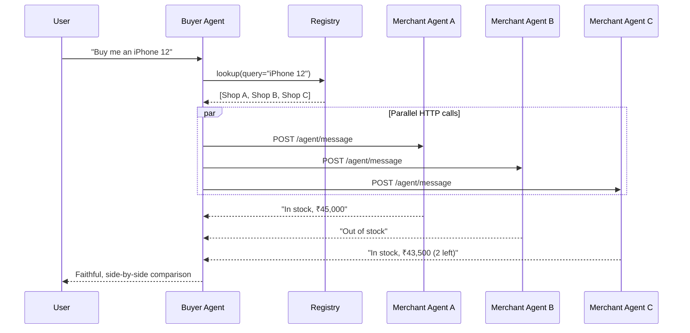

<div align="center">


</div>
<div align="center">

#  Buyer Agent

### An LLM-driven shopping agent that talks to *any* registered merchant agent through one address book

[](#)
[](#)
[](#)
[](https://github.com/Sachin-MR05/Ecommerce-App)
[](#)

*The buyer-side counterpart to [`merchant-agent-core`](https://github.com/Sachin-MR05/Ecommerce-App) — same think → act → observe loop, same LLM-decides / Executor-enforces split.*

</div>

---

## 📇 Abstract

Every shop that wants to be "AI-shoppable" today has to solve the same problem from scratch: *how does a buyer's agent find me, trust me, and talk to me?* Without a shared answer, every buyer agent ends up hand-wiring a one-off integration per merchant — the agentic-commerce equivalent of memorizing every phone number in your city instead of using a directory.

**Buyer Agent solves this with a single idea: a merchant agent registry that behaves like a phone directory for AI agents.**

- A merchant lists itself **once** — a name, a description, one HTTPS endpoint (`/agent/message`), and an auth token. That's its "phone number."
- A buyer agent never needs to know *how* a merchant is built internally (Java, Python, a monolith, a swarm of microservices — irrelevant). It just needs the number.
- To shop, the buyer agent looks up the relevant entries in the directory, **dials several of them at once**, has a natural-language conversation with each, and brings back a single, comparable answer to the user.
- Checkout — the one irreversible action — always requires the user to explicitly pick up the phone and say "yes."

In short: **one endpoint contract + one registry = N buyer agents can talk to M merchant agents without N×M custom integrations.**

---

## 📚 Table of Contents

1. [Why We Built This, Now](#-why-we-built-this-now)
2. [Scope](#-scope)
3. [Who Are the Users](#-who-are-the-users)
4. [Core Concept — The Merchant Registry as a Phone Directory](#-core-concept--the-merchant-registry-as-a-phone-directory)
5. [System Architecture](#-system-architecture)
6. [Talking to Shops in Parallel](#-talking-to-shops-in-parallel)
7. [Where This Sits in the Agentic Commerce Protocol Landscape](#-where-this-sits-in-the-agentic-commerce-protocol-landscape)
8. [Privacy-First Merchant Adoption](#-privacy-first-merchant-adoption)
9. [Technical Stack](#-technical-stack)
10. [Project Structure & Modules](#-project-structure--modules)
11. [How We Measure Success](#-how-we-measure-success)
12. [Glossary](#-glossary)
13. [Challenges We Ran Into](#-challenges-we-ran-into)
14. [Merchant-Side Repository](#-merchant-side-repository)
15. [References & Prior Art](#-references--prior-art)

---

## 🤔 Why We Built This, Now

Chat-based agents can already *talk about* shopping — they can describe products, compare specs, and write reviews from memory. What they mostly can't do yet is **transact**, safely, across shops that were never designed to talk to a bot.

2025–2026 is the moment several large players independently converged on the idea that commerce needs an *agent-facing* layer: OpenAI and Stripe shipped the Agentic Commerce Protocol, Google shipped the Agent Payments Protocol, Visa shipped a Trusted Agent Protocol, and Coinbase shipped x402 for machine-to-machine settlement. That convergence is a strong signal that "a buyer's agent negotiating with a merchant's agent" is becoming a real category, not a research toy.

Buyer Agent was built to learn that category hands-on, at small scale, with the same architectural bones as the systems above:

- a **registry** instead of hardcoded integrations,
- an **LLM decision loop** instead of if/else scripts,
- a **hard human-in-the-loop gate** before money moves,
- and a **faithful-relay rule** so the agent never invents a price it didn't actually hear from the merchant.

---

## 🎯 Scope

**In scope**

- A buyer-side agent that can identify relevant merchants, query them in natural language, compare answers, and drive a checkout to a payment link.
- A merchant agent registry (add / view / manage merchant agent entries) with encrypted credential storage.
- A chat frontend where each merchant's sub-conversation is inspectable, and a registry-management frontend for onboarding shops.
- The wire contract merchants must implement (`POST /agent/message`) to be reachable by any buyer agent, not just this one.

**Out of scope (for now)**

- Real money movement — checkout produces a payment link/order handoff, it does not itself process card or bank rails.
- Cross-network settlement (stablecoins, card-network tokenization) — the project models the *conversation and authorization* layer, not a payment gateway.
- Public/federated merchant discovery — today the registry is a single buyer agent's private address book, not a shared, internet-wide directory.

---

## 👥 Who Are the Users

| User | What they get |
|---|---|
| **Shopper (end user)** | A single chat that can shop across every registered shop at once, compare real answers side by side, and stays in control of the only step that spends money. |
| **Merchant / shop owner** | A way to become "agent-reachable" by exposing one endpoint and one manifest, without rebuilding their storefront or handing over their whole database. |
| **Developer building a buyer agent** | A reference implementation of the LLM-decides / Executor-enforces pattern for a *buying* agent, mirroring the *selling* agent on the merchant side. |
| **Reviewer / auditor** | Per-merchant transcripts (`merchantThreads`) that make every claim the agent relayed to the user traceable back to what the merchant actually said. |

---

## 📇 Core Concept — The Merchant Registry as a Phone Directory

The registry is the whole trick. Instead of the buyer agent knowing how to talk to "Amazon" or "Flipkart" or "the local phone shop" individually, it knows how to look up **one row of a directory** and dial the same kind of number every time.

| Directory concept | Buyer Agent equivalent |
|---|---|
| Business name in the phone book | `name` |
| What the business does | `description` |
| Phone number | `agentUrl` → `POST /agent/message` |
| Access / extension code | `authToken` (stored encrypted, never re-shown after save) |
| Optional listed contact | `contactPhone` |

 
The Buyer Agent's **Merchant Registry** is the **Contacts app**. Nothing can be called until it's saved here.
 


**How a merchant gets listed:**

1. The merchant runs `merchant-agent-core` (see [Merchant-Side Repository](#-merchant-side-repository)) and exposes its manifest — the same `merchant_manifest.json` / `AgentInfo.jsx` page a shop owner copies from.
2. In the Buyer Agent's registry UI, the shop owner (or an admin) pastes that manifest into a single box — name, description, agent URL, auth token, and an optional contact phone are extracted automatically or filled in.
3. The auth token is encrypted at rest and never displayed again after saving — the registry UI shows *that* a shop is registered, never the credential itself.
4. From that point on, the shop is just another dial-able entry — the buyer agent never needs custom code per merchant.

**How a lookup happens:**

- The user says something like *"buy me an iPhone 12."*
- The buyer agent's LLM decision loop treats *"which merchant(s) match this?"* as a tool call against the registry — a **search**, not a guess. If nothing matches, it tells the user the shop isn't registered rather than inventing one.
- If one or more matches exist, each becomes a target for a real `/agent/message` conversation (see [Talking to Shops in Parallel](#-talking-to-shops-in-parallel)).

This is deliberately the same shape as a phone directory: **look up → dial → talk → hang up**, with the registry as the only source of truth for "who can I call."

---

## 🏗 System Architecture



### Instruction set behind the LLM decision loop

```mermaid
flowchart TD
    ROOT["🟠 Buyer Agent System Instructions"]
    ROOT --> I1["1️⃣ Identity & Job<br/>'You are a shopping assistant acting on the user's behalf'"]
    ROOT --> I2["2️⃣ Information-gathering rule<br/>'Never contact a merchant until you know WHAT and WHICH SHOP'"]
    ROOT --> I3["3️⃣ Registry-first rule<br/>'Only contact merchants that exist in the registry — never invent a shop'"]
    ROOT --> I4["4️⃣ Comparison rule<br/>'When multiple shops match, query them in parallel and compare fairly'"]
    ROOT --> I5["5️⃣ Faithful relay rule<br/>'Summarize what a merchant actually said — never fabricate price/stock'"]
    ROOT --> I6["6️⃣ 🚦 Human-in-the-loop rule<br/>'NEVER call checkout without an explicit yes from the user'"]
    ROOT --> I7["7️⃣ Payment-confirmation rule<br/>'Do not mark an order complete until the merchant confirms payment'"]
    ROOT --> I8["8️⃣ Transparency rule<br/>'Keep each merchant's transcript separate and inspectable (merchantThreads)'"]

    style ROOT fill:#fed7aa,stroke:#c2410c,stroke-width:3px
    style I1 fill:#fef3c7
    style I2 fill:#fef9c3
    style I3 fill:#fefce8
    style I4 fill:#ecfccb
    style I5 fill:#d1fae5
    style I6 fill:#fecaca,stroke:#dc2626,stroke-width:2px
    style I7 fill:#fed7aa
    style I8 fill:#e0e7ff
```



### Why each instruction exists

| # | Instruction | Why it's given |
|---|---|---|
| 1 | Identity: "shopping assistant acting on the user's behalf" | Anchors every downstream decision to *whose interest* the agent optimizes for — the user's, not a merchant's. Stops the agent from favoring whichever shop replies fastest. |
| 2 | Don't contact a merchant without knowing what + which shop | Forces the very first turn to be a clarifying question instead of a guess — ambiguity is never resolved by assumption. |
| 3 | Registry-first, never invent a shop | Prevents the LLM from hallucinating a plausible-sounding `agentUrl` — every contact is traceable to a real, user-approved registry entry with a real auth token. |
| 4 | Parallel comparison for multiple matches | Encodes fairness and speed: the agent gives a real comparison instead of defaulting to the first shop it thinks of. |
| 5 | Faithful relay, no fabrication | Turns a merchant's raw reply into a user-facing summary without ever changing a number. |
| 6 | Human-in-the-loop before checkout | The single most load-bearing rule in the system — checkout is irreversible, so it's a hard gate, not a suggestion the LLM can talk itself out of. |
| 7 | Don't mark complete until merchant confirms payment | Stops the agent from prematurely declaring success based only on having *sent* a payment link. |
| 8 | Keep per-merchant transcripts inspectable | Lets a user or developer audit exactly what was said to each shop — critical for trust when an agent is negotiating on your behalf. |

---

## ⚡ Talking to Shops in Parallel

When more than one registry entry matches the user's request, the buyer agent does **not** query shops one after another — it fans out.



Design rules that make this safe:

- **Independent threads.** Each merchant gets its own `merchantThreads[merchantId]` conversation — one shop's confusion or bad answer never leaks into another shop's context.
- **Bounded fan-out.** Requests are issued concurrently but with a timeout per merchant, so one slow or dead shop can't stall the whole comparison.
- **Partial-failure tolerance.** A timeout, an auth error, or a stock-out from one merchant is folded into the comparison as a normal outcome (see the fallback flowchart above), not treated as a fatal error for the whole request.
- **No mixing of offers.** The agent never merges data across merchants into a single fabricated "best of both" answer — every price and stock number shown to the user is attributed to the merchant that actually said it.

---

## 🌐 Where This Sits in the Agentic Commerce Protocol Landscape

Buyer Agent is a learning/reference project, not a production implementation of any single standard — but it deliberately mirrors the shape that the wider industry has converged on through 2025–2026:

| Layer | Industry protocol(s) | What that layer standardizes | Buyer Agent's analogue |
|---|---|---|---|
| **Discovery / directory** | No single dominant standard yet — emerging "agent readiness" registries and manifests | How an agent finds out a merchant exists and is agent-reachable | The **merchant agent registry** (manifest paste + encrypted token) |
| **Checkout conversation** | **Agentic Commerce Protocol (ACP)** — Stripe, OpenAI, and Meta's open standard for agent-driven checkout (cart, feed, delegated checkout) | The request/response shape of "browse → cart → checkout" between an agent and a business | The `/agent/message` contract + the checkout branch of the decision flowchart |
| **Authorization / trust** | **Agent Payments Protocol (AP2)** — Google's payment-agnostic protocol using cryptographically signed "mandates" to prove a human authorized a purchase | Proving *this specific purchase* was actually approved by a human, not just the agent's own judgment | The hard **human-in-the-loop gate** before any checkout call |
| **Card-network identity** | **Visa Trusted Agent Protocol (TAP)** | Signing an agent's identity into the request so issuers/networks can recognize agent-initiated traffic | Out of scope today — the auth token is a registry-level credential, not a network-level agent identity |
| **Machine-to-machine settlement** | **x402** (Coinbase) — stablecoin micropayments over HTTP using the revived `402 Payment Required` status | Instant, sub-cent, agent-to-API payments without a human in the loop | Explicitly out of scope — every Buyer Agent checkout keeps a human in the loop by design |

**Where Buyer Agent deliberately differs:** production protocols like ACP and AP2 compose a *checkout* standard with a *trust* standard so an agent can carry a signed mandate into a merchant's checkout flow. Buyer Agent collapses that into a single project to make the pattern learnable end-to-end — registry lookup, natural-language negotiation, and a human approval gate all live in one buyer agent and one merchant agent, without yet integrating a real payment-token network.

---

## 🔒 Privacy-First Merchant Adoption

A merchant's biggest hesitation about "letting an AI talk to my shop" is usually *how much do I have to expose?* The registry model is designed to keep that surface as small as possible:

- **One endpoint, not a database connection.** A merchant exposes a single `/agent/message` endpoint backed by its own tool layer (`AgentTool` / `AgentToolRegistry` on the merchant side) — the buyer agent never gets direct database or admin access.
- **Merchant controls what a tool reveals.** Stock and price come from the merchant's own `CheckStockTool` / `GetPriceTool` calls, so a merchant only ever exposes the fields it chose to wire up — nothing is scraped or inferred.
- **Credentials are one-way.** The registry stores the merchant's auth token encrypted and never re-displays it after save — even the buyer-agent operator can't read it back out of the UI.
- **No shared, public directory (yet).** Registration is opt-in and private to the buyer agent instance a merchant was added to — a shop is not discoverable by every buyer agent on the internet, only the ones it was explicitly given the token for.
- **Auditable by design.** Because every merchant gets its own inspectable transcript, a merchant can, in principle, be shown exactly what was said on its behalf — there's no hidden aggregation step.

This is the same instinct behind AP2's mandate model and ACP's scoped payment tokens: give the agent *just enough* to do the specific job, and make every step attributable, so adopting agentic commerce doesn't mean handing an AI the keys to the whole store.

---

## 🧰 Technical Stack

| Layer | Choice | Notes |
|---|---|---|
| **Buyer agent core** | Python (Planner → LLM → Decision → Executor → AgentLoop → Gateway) | Mirrors the merchant-side `merchant-agent-core` architecture so both halves share one mental model |
| **Merchant reachability** | HTTP(S), `POST /agent/message` | The one wire contract every merchant must implement to be registry-eligible |
| **Registry storage** | Encrypted-at-rest key/value store for merchant manifests + tokens | Token write-only after save |
| **Frontend — chat** | JS/React-style SPA | Sidebar of past chats, collapsible per-merchant sub-conversations, checkout confirmation gate |
| **Frontend — registry management** | JS/React-style SPA | Single manifest-paste box + structured fields (name, description, URL, token, optional contact) |
| **Merchant side (separate repo)** | Java (`AgentTool`/`AgentToolRegistry`, `GET /tools`, `POST /tools/{name}/execute`) + Python `merchant-agent-core` | See [Merchant-Side Repository](#-merchant-side-repository) |
| **Local orchestration** | `start.bat` / `start.ps1` | One-command local bring-up of the buyer-agent stack on Windows |

---

## 🗂 Project Structure & Modules

```
Buyer_agent/
├── buyer-agent-core/          # Python service — the LLM decision loop
│   ├── planner/                #   turns user intent into a plan (search / query / compare / checkout)
│   ├── decision/                #   LLM-decides layer — chooses the next tool call, never the final number
│   ├── executor/                #   Executor-enforces layer — actually calls registry/merchant tools
│   ├── agent_loop/              #   think → act → observe orchestration
│   ├── gateway/                 #   outbound HTTP client for /agent/message calls to merchants
│   └── registry/                #   registry read/write, manifest parsing, token encryption
│
├── buyer-agent-frontend/      # Chat + registry-management UI
│   ├── chat/                    #   sidebar + main pane, collapsible merchantThreads, checkout gate
│   └── registry/                #   manifest paste box, registry list/detail views
│
├── start.bat / start.ps1      # Local bring-up scripts
└── .gitignore
```

**Module responsibilities at a glance**

| Module | Responsibility | Guardrail it enforces |
|---|---|---|
| Planner | Decide *what* needs to happen next (clarify, search registry, query shops, checkout) | Rule #2 — never contact a merchant without knowing what + which shop |
| Decision (LLM) | Pick the next tool call from the plan | Rule #3 — registry-first, never invent a shop |
| Executor | Actually perform the tool call (HTTP request, registry read) | Rule #6 — checkout tool is only reachable after an explicit user "yes" |
| Gateway | Send/receive `/agent/message` traffic, handle timeouts | Reports failures rather than retrying silently |
| Registry | Store/retrieve merchant manifests, encrypt tokens | Token never re-displayed after save |
| Chat frontend | Show per-merchant transcripts, surface the checkout gate | Rule #8 — transparency via inspectable `merchantThreads` |

---

## 📊 How We Measure Success

Because checkout in this project ends at a payment link/order handoff rather than a live payment rail, success is measured as a **design-and-reliability project**, tracked across two tiers:

### Top-line (does the agent actually do its job well?)

| Metric | What it tells us |
|---|---|
| **Merchant match precision** | Of the merchants the agent contacted, how many were genuinely relevant to the user's request (vs. a bad registry-search match) |
| **Comparison completeness** | % of multi-merchant requests where all reachable shops responded before the comparison was shown, vs. partial timeouts |
| **Relay faithfulness** | Spot-checked agreement between what a merchant actually returned and what the agent told the user (target: zero fabricated prices/stock) |
| **Checkout-gate integrity** | % of checkout calls preceded by an explicit user "yes" (target: 100% — this is a correctness bar, not a KPI to optimize) |

### Bottom-line (is the system efficient and trustworthy to run?)

| Metric | What it tells us |
|---|---|
| **Median parallel-query latency** | Time from "user asks" to "comparison shown," bounded by the slowest non-timed-out merchant |
| **Silent-failure rate** | Count of any error path that did *not* surface a message to the user (target: zero, per Fallback Principle #4) |
| **Registry onboarding time** | Time from pasting a manifest to a merchant being reachable in chat — a proxy for how low the adoption friction is |
| **Token exposure incidents** | Any event where a stored auth token was displayed or logged in plaintext after save (target: zero) |

These mirror the two questions real agentic-commerce platforms are graded on publicly — did the agent represent the merchant and the buyer faithfully, and did it move fast enough, safely enough, to be worth trusting with a purchase.

---

## 📖 Glossary

| Term | Meaning in this project |
|---|---|
| **Buyer agent** | The agent acting on the user's behalf — the subject of this repo |
| **Merchant agent** | A shop's own agent, exposing `/agent/message` (built in the [merchant-side repo](https://github.com/Sachin-MR05/Ecommerce-App)) |
| **Registry** | The buyer agent's address book of merchant agents — name, description, endpoint, auth token |
| **Manifest** | The JSON a merchant publishes describing itself (`merchant_manifest.json`) — what gets pasted into the registry UI |
| **`merchantThreads`** | The per-merchant conversation transcript kept separate for transparency/audit |
| **Think → act → observe loop** | The agent loop shape shared by both the buyer and merchant agents: reason about the next step, call a tool, read the result, repeat |
| **LLM-decides / Executor-enforces** | The split where the LLM only *chooses* which tool to call; a separate, non-LLM Executor is what actually performs the side-effecting action (like checkout) |
| **Human-in-the-loop gate** | The explicit user confirmation required before the one irreversible action (checkout) can run |
| **Mandate** *(industry term, AP2)* | A cryptographically signed statement proving a human authorized an agent's specific action — the standards-based version of this project's checkout gate |
| **Shared/scoped payment token** *(industry term, ACP)* | A narrowly-scoped token an agent hands to a merchant so it can charge only what was authorized, without exposing raw card details |

---

## 🚧 Challenges We Ran Into

- **Ambiguity resolution without guessing.** Getting the LLM decision layer to *reliably* ask a clarifying question instead of picking a "probably right" merchant or SKU took explicit prompt-level rules (#2 and #3) — general-purpose LLM helpfulness naturally wants to just proceed.
- **Parallel calls without cross-contamination.** Early designs let merchant replies leak into a shared context window; splitting into independent `merchantThreads` per merchant fixed comparison bias but added state-management complexity on the frontend (collapsible per-shop views).
- **Partial failure in a fan-out.** Deciding what "done" means when 2 of 3 shops answered and 1 timed out — the fallback flowchart's per-branch handling (B1/B2/C1/C2) exists specifically because a single fail-fast/fail-all rule produced a worse user experience than tolerating partial results.
- **Faithful relay vs. natural language.** The merchant agent doesn't return structured JSON for every field — it replies in natural language ("The iPhone 12 is available for 45000 INR..."). Turning that into a trustworthy summary without the LLM silently rounding, converting currency, or "helpfully" inferring a discount required a hard rule (#5) plus spot-checking.
- **Credential handling in a student-scale project.** Encrypting tokens at rest and refusing to ever re-display them is easy to state and easy to accidentally violate (a debug log, a returned API field) — this needed to be a deliberate, tested constraint, not an afterthought.
- **Scoping against a fast-moving industry.** ACP, AP2, x402, and Visa TAP all shipped or materially changed within the build window of this project — keeping the architecture *inspired by* rather than *tightly coupled to* any one spec kept the project buildable at student scale while staying conceptually aligned with where the industry landed.

---

## 🏪 Merchant-Side Repository

The buyer agent is only half the system. The other half — the merchant's own agent, its tool layer, and the manifest a shop publishes to get listed in the registry — lives here:

```markdown
Merchant side: https://github.com/Sachin-MR05/Ecommerce-App
```

That repo contains:
- A Java backend exposing `AgentTool` / `AgentToolRegistry` via `GET /tools` and `POST /tools/{name}/execute`.
- A Python `merchant-agent-core` service (Planner → LLM → Decision, Executor, AgentLoop, Gateway) exposing `POST /agent/message` — the exact endpoint this buyer agent dials.
- `merchant_manifest.json` and an `AgentInfo.jsx` page shops use to generate and copy their registry entry (name, description, `agentUrl`, `authToken`, optional `contactPhone`).

---

## 🔗 References & Prior Art

**Agentic commerce & payment protocols**

- [Agentic Commerce Protocol (ACP)](https://github.com/agentic-commerce-protocol/agentic-commerce-protocol) — Stripe, OpenAI & Meta's open standard for agent-driven checkout, cart, and feed
- [Stripe Docs — Agentic Commerce Protocol](https://docs.stripe.com/agentic-commerce/acp) — building blocks: agentic checkout, cart & feed, delegated payment, delegated auth
- [Google Cloud — Announcing the Agent Payments Protocol (AP2)](https://cloud.google.com/blog) — the mandate-based trust/authorization layer for agent-led payments
- [Visa Trusted Agent Protocol (TAP)](https://usa.visa.com) — signs agent identity into the request at the card-network level
- [x402 Foundation](https://www.x402.org) — stablecoin micropayments over HTTP using the `402 Payment Required` status, donated to the Linux Foundation

**Payment platforms worth studying for merchant onboarding & credential UX**

- [Razorpay](https://razorpay.com) — merchant onboarding, API-key/secret issuance, and webhook-based order confirmation patterns
- [PayPal Developer](https://developer.paypal.com) — delegated checkout and order-confirmation flows; PayPal is also building its own ACP-compatible checkout server
- [Paytm for Business](https://business.paytm.com) — QR/endpoint-based merchant registration at small-merchant scale, relevant to the "one endpoint = one listing" model here

**This project's own components**

- Merchant side: [`Ecommerce-App`](https://github.com/Sachin-MR05/Ecommerce-App)
- Buyer side (this repo): [`Buyer_agent`](https://github.com/Sachin-MR05/Buyer_agent)

---
##  **About Me**

<div align="center">
  
</div>

<p align="center">
  <strong>SACHIN M R</strong> - Passionate AI &amp; Machine Learning Enthusiast
</p>

<p align="center">
  I am dedicated to harnessing the power of <strong>Artificial Intelligence</strong> to make people's lives easier and enable autonomous systems across every field. My journey involves deep learning, machine learning, and AI agents.
</p>

<div align="center">

### **Current Focus**

</div>

<p align="center">
  📚 <strong>Learning &amp; mastering Deep Learning architectures</strong><br>
  🤖 <strong>Building AI Agents with advanced reasoning capabilities</strong><br>
  🌍 <strong>Creating autonomous systems for real-world problems</strong><br>
  🛰️ <strong>Satellite imagery analysis &amp; geospatial AI applications</strong>
</p>

<div align="center">

### **Connect & Follow**

  <a href="https://www.linkedin.com/in/mr-sachin">
    
  </a>
  <a href="https://github.com/Sachin-MR05">
    
  </a>
  <a href="https://huggingface.co/mr-sachin">
    
  </a>

</div>

<p align="center">
  Eager to connect for collaborations, internships, and meaningful technical discussions.
</p>

---

<div align="center">

### **Made with ❤️ by Sachin**

*Empowering autonomous systems for a better future*

</div>
