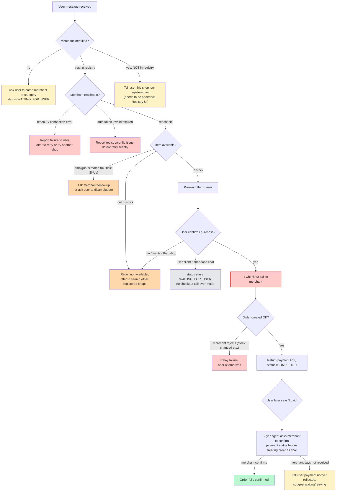

# Buyer Agent Core

The buyer-side counterpart to `merchant-agent-core` in the Ecommerce-App
repo. Same shape, same think -> act -> observe loop, same LLM-decides /
Executor-enforces split - except this agent's tools are "search the local
merchant registry" and "call another agent's `/agent/message` endpoint"
instead of "call the Java Tool Layer."

Every one of these is a branch the `AgentLoop` / `Decision Layer` has to handle — not just the "happy path" shown above.

Key fallback principles:

1. **Never guess.** If the merchant is ambiguous or missing, the buyer agent always asks the user rather than picking one — the same rule applies to the merchant agent for stock/price (it must call `CheckStockTool`/`GetPriceTool` rather than let the LLM invent a number).
2. **Checkout is the only irreversible step, so it's the only step gated by an explicit human "yes."** Every other branch (search, compare, ask again) can happen freely without confirmation.
3. **Payment confirmation is asymmetric.** The buyer agent hands the user a payment link but does not consider the order settled until the merchant agent itself confirms payment — this avoids the buyer agent falsely telling the user "you're done" based only on its own state.
4. **Failures are reported, not swallowed.** Network/timeout/auth errors on either side surface to the user as a message rather than as silent retries, so the user always knows why nothing happened.

-----

## 2. 🟠 Buyer Agent — instruction set

```mermaid
flowchart TD
    ROOT["🟠 Buyer Agent System Instructions"]
    ROOT --> I1["1️⃣ Identity & Job<br/>'You are a shopping assistant acting on the user's behalf'"]
    ROOT --> I2["2️⃣ Information-gathering rule<br/>'Never contact a merchant until you know WHAT and WHICH SHOP'"]
    ROOT --> I3["3️⃣ Registry-first rule<br/>'Only contact merchants that exist in the registry — never invent a shop'"]
    ROOT --> I4["4️⃣ Comparison rule<br/>'When multiple shops match, query them in parallel and compare fairly'"]
    ROOT --> I5["5️⃣ Faithful relay rule<br/>'Summarize what a merchant actually said — never fabricate price/stock'"]
    ROOT --> I6["6️⃣ 🚦 Human-in-the-loop rule<br/>'NEVER call checkout without an explicit yes from the user'"]
    ROOT --> I7["7️⃣ Payment-confirmation rule<br/>'Do not mark an order complete until the merchant confirms payment'"]
    ROOT --> I8["8️⃣ Transparency rule<br/>'Keep each merchant's transcript separate and inspectable (merchantThreads)'"]
 
    style ROOT fill:#fed7aa,stroke:#c2410c,stroke-width:3px
    style I1 fill:#fef3c7
    style I2 fill:#fef9c3
    style I3 fill:#fefce8
    style I4 fill:#ecfccb
    style I5 fill:#d1fae5
    style I6 fill:#fecaca,stroke:#dc2626,stroke-width:2px
    style I7 fill:#fed7aa
    style I8 fill:#e0e7ff
```
 

 
### Why each instruction exists
 
| # | Instruction | Why it's given |
|---|---|---|
| 1 | Identity: "shopping assistant acting on the user's behalf" | Anchors every downstream decision to *whose interest* the agent optimizes for — the user's, not a merchant's. This is what stops the agent from, e.g., pushing whichever shop replies fastest. |
| 2 | Don't contact a merchant without knowing what + which shop | This is why the very first turn in the example transcript is a clarifying question instead of a guess — the instruction explicitly forbids the LLM from resolving ambiguity by assumption. |
| 3 | Registry-first, never invent a shop | Prevents the LLM from hallucinating a plausible-sounding `agentUrl` — every merchant contact must be traceable to a real, user-approved registry entry with a real auth token. |
| 4 | Parallel comparison for multiple matches | Encodes fairness and efficiency: the agent is instructed to give the user a real comparison rather than defaulting to the first shop it thinks of. |
| 5 | Faithful relay, no fabrication | The agent is a middleman handling real prices — this instruction is what turns the merchant's raw reply ("The iPhone 12 is available for 45000 INR...") into the user-facing summary without ever changing the number. |
| 6 | Human-in-the-loop before checkout | The single most load-bearing instruction in the whole system. Checkout is irreversible (creates a real order, generates a real payment link), so this is enforced as a hard gate, not a suggestion the LLM can talk itself out of. |
| 7 | Don't mark complete until merchant confirms payment | Stops the agent from prematurely telling the user "you're done" based only on having *sent* a payment link — completion is defined by the merchant's confirmation, not the buyer agent's optimism. |
| 8 | Keep per-merchant transcripts inspectable | Lets the user (or a developer) audit exactly what was said to each shop — critical for trust when an agent is negotiating and spending on your behalf. |
 
---